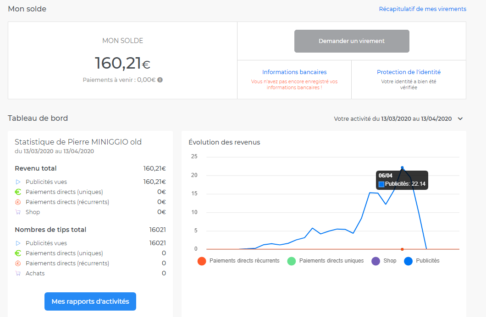

# utip-io-scraper

Permet de regarder automatiquement les publicités sur utip.io.
- Passe outre la limite journalière de utip.io via le proxy de tor
- A regardé au total 16021 publicités
- Peak a 22,14€ / jour avec 3 PC et 7 machines virtuelles faisant tourner le script

Le 8 avril 2020, utip.io m'a envoyé un mail d'indiquant qu'il considérait mon activité contre leurs conditions et m'ont demandé d'arrêter, et on annuler le virement qui m'aurait reversé les gains suite à la lecture des publicités.
Le 27 juillet 2020, utip.io a décidé de retirer la publicité de leur site, ce qui rend mon script inutilisable à présent.

Résultats :

